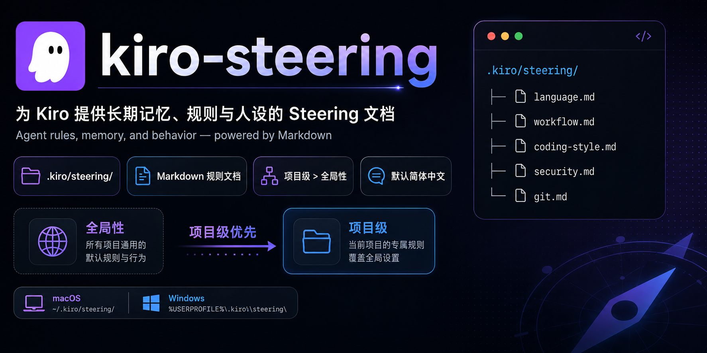

# kiro-steering

## 什么是Steering

简单地说，Steering是更适合Kiro体质的agent.md或claude.md。

## Kiro Steering的路径、形式、优先级

Kiro支持用一个或多个md文档来提供长期记忆、人设、规则，Kiro不在乎这些文档的名称，只要放在指定路径`.../.kiro/steering/`内，它就会主动遵守。

### 常用路径

【全局性】

- macOS默认：`/Users/mac/.kiro/steering`
- Windows默认：`C:\Users\Administrator\.kiro\steering\`

【项目级】

...\<你的某个项目文件夹根目录>\.kiro\steering\

### 规则形式

写一个或若干个md文档，放在`steering`文件夹内即可，命名无要求。示例：

```Plain Text
C:\Users\Administrator\.kiro\steering\
├── language.md
├── workflow.md
├── coding-style.md
├── security.md
└── git.md
```

如果你只想放一个文档，那么建议命名为steering.md或agen.md

### 遵守优先级

项目级＞全局性。冲突时，kiro优先遵守项目级的steering

## 最佳实践

笔者发现，Kiro在高峰期总爱在聊天窗口显式注入英文或日语，完全不管我开会话时用的是中文和它沟通。即使你在该会话内要求他用中文答复，它聊几句之后还是会走神又开始说鸟语。

我选择用下面的脚本自动定位并打开kiro全局配置目录的`.kiro/steering`，然后我可以新建一个language.md用于要求kiro遵守：

> - 默认始终使用简体中文回答用户，术语、代码等可以保留英文。

### 脚本

macOS：

[open-kiro-steering.zsh](attachments/open-kiro-steering.zsh)

Windows：

[open-kiro-steering.cmd](attachments/open-kiro-steering.cmd)

功能：自动定位并打开kiro的全局性Steering文件夹

用法：

- WIN，双击打开。
- macOS，打开终端，输入zsh+空格，拖入脚本，回车
